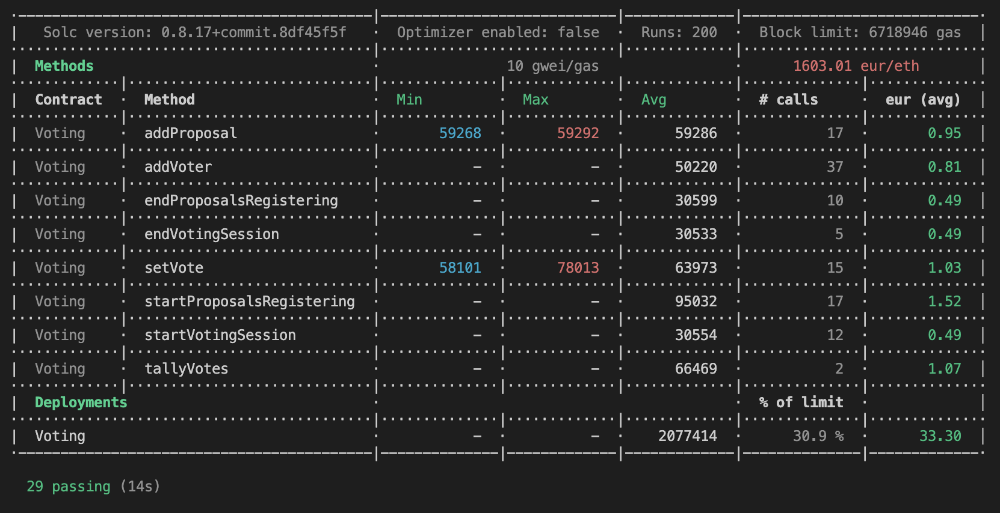

# Smart contract Voting and Testing
This repository contains the contracts of a voting system in the form of smart contracts in solidity as well as its unit tests.
 
## Quick start
These instructions will allow you to get a working copy of the project on your local.

## Prerequisites
In order to run the application on your computer, you must first install the following dependencies:
* NodeJS
* OpenZepplin
* Truffle
* test-helpers
* ganache

## Exécution
1. Open a TERMINAL at the root of the project
2. Make sure you have the npm dependencies installed `npm install`
3. Run `ganache` with a second terminal

## Tests
### Unit tests
1. Launching a local ethereum blockchain using Ganache with a first terminal 
2. Run `truffle test` with a second terminal

# Coverage
All the functions and modifier of the contract are tested : 
## `Genesis proposal`:
* check if we are genesis proposal and is 'GENESIS' content
## `getVoter()`:
* Revert if not voter
## `addVoter()` : 
* Owner rights
* RegisteringVoter status
* Voter doesn't have already voted
* proposalId is null
* voter doesn't have already registered
* VoterRegistred Event works
* VoterRegistred Event works every-time an voter is added
* get a specific voter
## `addProposal()`:
* Check status ProposalsRegistrationStarted
* Check description of proposal
* Check voteCount of proposal is equal 0 at the begining
* Check event ProposalRegistered
## `Voting session`:
* Check VotingSessionStarted session
* Revert is is not a voter
* Check is voter has already voted
* revert if voter has already voted
* Check the correspondane of the ids
* Check voteCount increment
* Check event Voted
## `Tally votes`:
* Check onlyOwner status
* check current status
* Check winnerId
## Test change all sessions from owner only : 
* Revert all cases where the caller is not the owner

